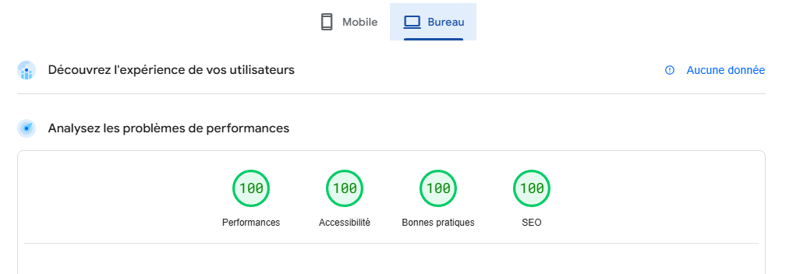

# **Analyse SEO pour Maison Verte - Aménagement Paysager Écologique à Lyon**

## **1. Objectifs du SEO**
L'objectif de cette stratégie SEO est de :
- Accroître la **notoriété** de Maison Verte à Lyon et en Rhône-Alpes.
- Attirer un **public local** intéressé par des solutions d’aménagement écologique.
- Optimiser le site web pour obtenir **30 demandes de devis par mois** et **1000 visites organiques mensuelles**.
- Se différencier des concurrents en se positionnant sur des mots-clés spécifiques liés à l’écologie.

---

## **2. Analyse des mots-clés**
### **Mots-clés principaux**
- **paysagiste écologique Lyon**
- **aménagement paysager écologique**
- **jardin écologique**
- **permaculture urbaine**
- **biodiversité jardin**

### **Mots-clés secondaires**
- **entretien jardin écologique**
- **compostage naturel**
- **haies naturelles**
- **potager urbain Lyon**
- **récupération d’eau jardin**

**Recommandation :**  
Ces mots-clés doivent être intégrés naturellement dans les contenus du site (titres, articles de blog, descriptions de services).

---

## **3. Étude de la concurrence**
Une analyse des 10 premiers résultats Google pour *"paysagiste écologique Lyon"* a été réalisée. Voici les principales observations :

| **Site** | **Forces** | **Faiblesses** |
|---|---|---|
| https://www.maisonverte.fr/ | Bonne autorité de domaine, forte présence Google My Business | Design daté, peu de contenu optimisé |
| https://www.lamaisonvertesete.com/fr/blog | Blog actif, backlinks de qualité | Chargement lent, mauvaise optimisation mobile |
| https://www.facebook.com/LaMaisonVerte69/?locale=fr_FR | Bonne présence sur les réseaux sociaux | Peu de backlinks externes |

### **Opportunités pour Maison Verte**
- Travailler le référencement **local** via Google My Business et avis clients.  
- Publier des **guides éducatifs** et articles pour capter du trafic organique.  
- Améliorer la **vitesse de chargement** et l’optimisation mobile.  

---

## **4. Identification des intentions de recherche**
Les intentions de recherche des utilisateurs peuvent être classées en plusieurs catégories :

| **Type d’intention** | **Exemples de recherches** | **Action à mener** |
|---|---|---|
| **Navigationnelle** | "Maison Verte Lyon" | Optimiser le référencement de marque |
| **Informationnelle** | "Comment entretenir un jardin écologique ?" | Rédiger des articles de blog éducatifs |
| **Transactionnelle** | "Paysagiste écologique à Lyon devis" | Créer une page claire avec un appel à l’action |
| **Comparative** | "Meilleur paysagiste bio Lyon" | Ajouter des témoignages et études de cas |

**Recommandation :**  
Ajouter une **FAQ** sur le site pour répondre aux principales questions des utilisateurs.

---

## **5. Carte de chaleur des opportunités SEO**
Voici une priorisation des actions SEO en fonction de leur **impact** et de leur **facilité de mise en place**.

| **Opportunité SEO** | **Impact** | **Facilité de mise en place** | **Priorité** |
|---|---|---|---|
| Optimisation des balises **title** et **meta descriptions** | Élevé | Facile | Prioritaire |
| Création de **contenus optimisés (articles, guides)** | Élevé | Moyenne | Prioritaire |
| Ajout d’une section **témoignages clients** | Moyen | Facile | Importante |
| Renforcement des **backlinks de qualité** | Élevé | Difficile | Importante |
| Optimisation de la vitesse du site | Moyen | Moyenne | Moyenne |
| SEO local : Google My Business et avis | Élevé | Moyenne | Prioritaire |

**Actions immédiates recommandées :**
1. Améliorer les **balises title et meta descriptions** avec des mots-clés pertinents.
2. Rédiger un premier **article de blog optimisé** (ex : "Pourquoi privilégier une haie naturelle ?").
3. Encourager les clients à laisser des **avis sur Google** pour renforcer la visibilité locale.

---

## **6. Analyse de performance (PageSpeed Insights)**

L’optimisation de la vitesse du site est un facteur clé pour le référencement SEO et l’expérience utilisateur. Voici les résultats obtenus avec **Google PageSpeed Insights**.

### **Score de performance :**
- **Mobile** :
  
  
- **Desktop** :
  

### **Analyse des résultats**
- **Desktop** : Score **100/100** sur toutes les métriques (**performances, accessibilité, bonnes pratiques et SEO**).
- **Mobile** : Score très élevé avec **99 en performances**, **100 en accessibilité**, **96 en bonnes pratiques**, et **100 en SEO**.

### **Axes d’amélioration possibles (mobile) :**
Bien que le score mobile soit presque parfait, une légère amélioration des **bonnes pratiques** peut être envisagée :
1. **Optimisation supplémentaire des scripts et du responsive** pour atteindre 100 en bonnes pratiques.
2. **Éventuelle réduction du temps de réponse initial** pour maximiser le score de performance.

Avec ces résultats, le site est **très bien optimisé** pour le SEO et l'expérience utilisateur, garantissant une **bonne indexation et un excellent temps de chargement**.
